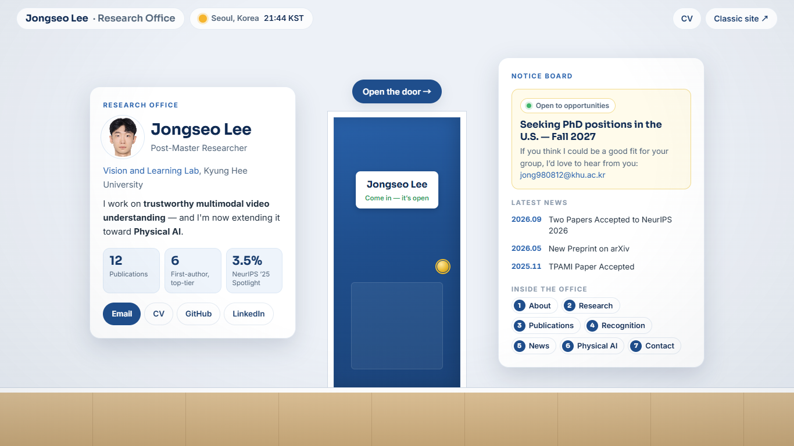
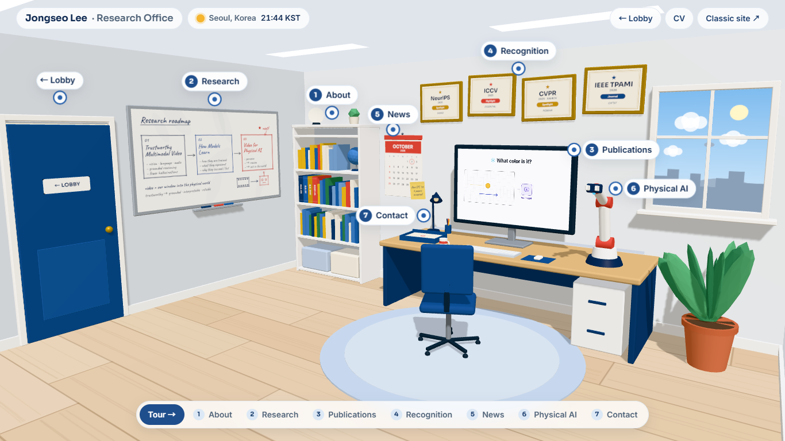
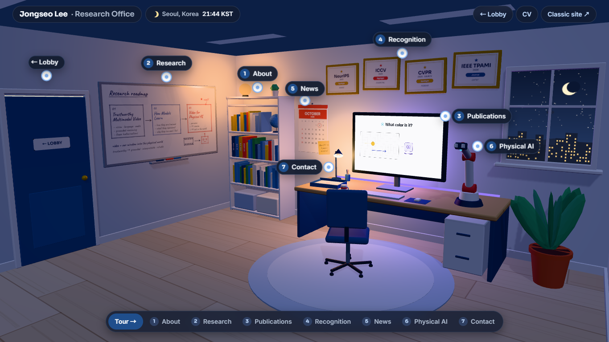

<div align="center">

# 🚪 Walk-in Homepage

## Every academic homepage is a list.<br>This one has a door.

**Knock. Read the notice board. Open the door. Look around my office.**

### [▶ &nbsp;Open the door — live demo&nbsp; ◀](https://jong980812.github.io/office/)

[](https://jong980812.github.io/office/)
[](https://claude.com/claude-code)
[](#run-it-locally)
[](LICENSE)

| 🚪 Knock, knock | 💡 Come in | 🌙 Stay late |
| :---: | :---: | :---: |
|  |  |  |
| A lobby with who I am and what's new | Every object opens a section | After sunset in Seoul, the lamps come on |

### Want one? &nbsp;Clone it → tell Claude who you are → move in.

[**Keep my style**](#route-1--keep-this-style-make-it-yours) &nbsp;·&nbsp;
[**Build your own room**](#route-2--start-from-scratch-with-this-as-the-reference) &nbsp;·&nbsp;
[**Add a room to the site you already have**](#route-3--add-a-room-to-the-homepage-you-already-have)

</div>

---

A photo, a bio, a list of papers — you have seen that homepage a thousand times, and so has every
professor reading applications this year. I wanted mine to feel like **visiting someone**. So you
arrive at my door, read the notice board, open the door, and look around: the monitor plays my
latest paper, the whiteboard holds my research roadmap, the frames on the wall are my awards, and
the robot arm on the desk is what I'm working on next.

A confession: **I am not a front-end designer. I am not a web expert.** I study video models. I
can't center a div without looking it up. They say science is done by standing on the shoulders of
giants — I just climbed onto Claude's shoulders and pointed. I described what I wanted to Claude
Code, sentence by sentence, and this is what came out.

I'm sharing all of it so that **other researchers can make their own.** Take mine and swap in your
content, build a completely different room with this as the reference, or add a room onto the
homepage you already have. Each route below comes with a prompt you can paste straight into
Claude Code.

> I'm [Jongseo Lee](https://jong980812.github.io/), a researcher working on trustworthy multimodal
> video understanding and Physical AI — and looking for PhD positions in the U.S. for Fall 2027.

## What's in the room

| # | Object | Opens | |
| :---: | --- | --- | --- |
| 1 | Bookshelf | About | Degrees are the book spines |
| 2 | Whiteboard | Research | The roadmap is hand-drawn on a canvas |
| 3 | Monitor | Publications | Plays the teaser video of my latest paper |
| 4 | Wall of frames | Recognition | One frame per spotlight / highlight |
| 5 | Calendar | News | Always shows today's date |
| 6 | Robot arm | Physical AI | Follows your cursor and waves when clicked |
| 7 | Letter tray | Contact | |
| | Door | Back to the lobby | |

A few details I'm fond of:

- **It keeps my hours.** The badge in the top bar shows the time in Seoul. By day the office is
  bright; after sunset it turns into a late-night study session — dim room, desk lamp, LED strip
  behind the monitor — and the whole page follows into a dark theme. Click the badge to flip it.
- **The door is real.** The lobby wall has a hole where the doorway is; the 3D office is already
  running behind it, so when the door swings open you are looking at the actual room.
- **It still works as a homepage.** Every section is plain HTML in a side panel, there are deep
  links (`#publications`, `#news`, …), keyboard navigation, a phone layout, and a fallback if
  WebGL isn't available.
- **No build step.** Static files and three.js from a CDN. It runs on GitHub Pages as-is.

## Make your own

You need [Claude Code](https://claude.com/claude-code) (I used it with **Claude Fable 5.1**) and
whatever you'd put on a homepage: your CV, a photo, links to your papers.

```bash
git clone https://github.com/jong980812/office.git my-office
cd my-office
claude
```

Then pick a route. (For Route 3, clone it next to your existing site's folder.)

### Route 1 — Keep this style, make it yours

Same lobby, same room, your content. Paste this, with the brackets filled in:

```text
This repo is a walk-in 3D homepage. Keep its design, room layout and code structure, and
replace Jongseo Lee's content with mine.

About me: [name], [position] at [lab / institution], working on [research in one line].
My CV is at [./cv.pdf], my current homepage is [URL], and my photo is at [./me.jpg].
I live in [city, country].

Please:
1. Rewrite the lobby (profile plate, notice board) and every section panel in index.html from
   my CV. Don't keep anything of Jongseo's that I have no replacement for.
2. Update the 3D objects that carry text: the whiteboard roadmap, the award frames, the degree
   books and the calendar note (js/textures.js, js/room.js).
3. Replace the images and video in assets/ with mine, or with clean placeholders.
4. Switch the clock and the day/night theme to my time zone (js/clock.js), and give the visitor
   counter its own namespace (js/config.js).
5. Change the accent colour to [colour], if I gave one.
Then run it locally and show me screenshots of the lobby and the office, by day and by night.
```

### Route 2 — Start from scratch, with this as the reference

Your own room, your own idea. A lab bench, a library carrel, a darkroom, a hanok study, the bridge
of a spaceship — wherever your work actually feels like it lives.

```text
Use this repo only as a reference for how a walk-in homepage is put together: an entrance
screen, a transition into a 3D room, objects that open sections, content kept as plain HTML,
and a single config file that maps sections to objects and camera framing.

Build me a new one from scratch in a fresh folder. Don't reuse Jongseo's room, objects, text
or assets.

My concept: [the place — e.g. "a wet lab at night", "a tiny observatory"].
The mood: [e.g. "warm and cluttered", "clean and clinical"].
Sections and the object for each: [About → ?, Research → ?, Publications → ?, …]
About me: [name, position, institution, research in one line]. My CV is at [./cv.pdf].

Keep what makes the reference work: static files only, deployable on GitHub Pages, readable
without WebGL, usable on a phone. Start by proposing the room and the objects, and build once
I've agreed.
```

### Route 3 — Add a room to the homepage you already have

You don't have to throw your current site away. I didn't: my
[classic homepage](https://jong980812.github.io/) still lives at `jong980812.github.io`, and the
office is an extension built onto it at [`/office`](https://jong980812.github.io/office/). The
office took its content from the classic site, and each links to the other, so visitors can choose
the plain page or the door.

On GitHub Pages this is just a second repository: a repo named `office` under your account is
served at `https://<you>.github.io/office/`, next to your main site.

```text
I already have a homepage at [URL] (its source is in [../my-homepage], if you can read it).
I want to keep it exactly as it is and add a walk-in 3D office as an extension, the way this
repo extends jong980812.github.io.

1. Read my existing homepage and take all the content from there: bio, research, publications,
   awards, news, contact, photo and paper figures. Don't make me retype anything, and ask me
   only about what's missing.
2. Turn this repo into my office with that content [keeping this room / with this concept: …].
3. Point every "Classic site" link here at my existing homepage, and match its colours and
   fonts so the two feel like one site.
4. Tell me the one link or button to add on my existing homepage that leads to the office,
   and where you'd put it.
5. I'll publish this as a separate repo named [office], served at [<me>.github.io/office/].
   Check that every path works from that sub-folder.
Then run it locally and show me screenshots.
```

Whichever route you take, keep talking to it. Most of this site came from messages like *"the monitor is too
small"*, *"can I walk in through a door?"* and *"make it feel like studying at night"*.

### Put it online

Push to a GitHub repository, then **Settings → Pages → Deploy from a branch → `main` / root**.
Your office is live at `https://<you>.github.io/<repo>/` a minute later.

## Run it locally

Any static file server works:

```bash
python3 -m http.server 8765      # then open http://127.0.0.1:8765
```

Handy URLs while editing: `?hour=22` previews night, `#office` skips the lobby,
`#publications` opens a section directly.

## Browser support

Checked in Chrome at desktop and phone sizes (portrait and landscape) and in Safari; other modern
browsers should work too — tell me if yours doesn't. It needs WebGL; without it the lobby and every section still work, just without the room.

If the page looks broken right after an update, your browser is mixing old cached files with new
ones — a hard refresh (Ctrl+Shift+R, or Cmd+Shift+R on a Mac) fixes it. When you deploy your own
changes, bump the `?v=` number on the stylesheet and script tags in `index.html` so visitors never hit this.

## How it's put together

```
index.html        Page shell, the lobby, and the content of every panel (<template id="tpl-…">)
css/office.css    All styles; day and night colours are CSS variables at the top
js/
  main.js         Boot
  config.js       Sections, their 3D anchors and camera framing, room size, visitor counter
  ui.js           Chips, markers and the detail panel (works without WebGL)
  lobby.js        Entrance screen and the enter / exit transitions
  clock.js        Seoul clock → theme, window sky, lamps
  visitors.js     Visitor counter
  scene.js        Renderer, lights, pointer interaction, camera, frame loop
  room.js         The room and every object in it
  textures.js     Canvas-drawn textures (whiteboard, awards, calendar, …)
  util.js         Mesh and drawing helpers
  three.js        The one place that names the three.js CDN URL
assets/           Profile photo, paper thumbnails, teaser video
```

Where to change things by hand:

- **Text of a section** — its `<template>` in `index.html`. The lobby's "Latest news" list is
  generated from the News template, so news lives in one place.
- **Add or move a section** — `HOTSPOTS` in `js/config.js`, then build its object in `js/room.js`.
- **Colours** — the variables at the top of `css/office.css`; the night theme is the block
  right below them.
- **Visitor counter** — uses [Abacus](https://abacus.jasoncameron.dev), a free public counter.
  Set your own namespace in `js/config.js`, or `VISITOR_COUNTER = null` to remove it.

## Show me yours

**I'd love to see what you build.** If you make a walk-in homepage — with this code or without
it — open a pull request adding it to the list below, or just tag me.

- [Jongseo Lee — Research Office](https://jong980812.github.io/office/)
- *yours?*

**Backseat driving is welcome, too.** Think the lighting is off, the room needs a couch, or the
camera should do something smarter? [Open an issue](https://github.com/jong980812/office/issues)
and tell me how you'd do it. I mean it.

## Credits and license

Designed and built in conversation with [Claude Code](https://claude.com/claude-code), using
Claude Fable 5.1 — the room, the lobby, the night mode and this README included. 3D by
[three.js](https://threejs.org/).

**And thank you, sincerely, to every web developer who shared their work with the world.** The
shoulders I climbed onto are really yours: the people who built three.js, wrote the docs and the
tutorials, answered strangers' questions, and open-sourced what they knew. Someone who can't
center a div got to build this because of you.

The **code** is [MIT-licensed](LICENSE): use it, change it, ship it. The **content** is not part
of that — my photo, bio, and the paper figures and video in `assets/` belong to me and my
co-authors, so please replace them with your own.

---

<div align="center">

**한국어 요약** · 연구자 프로필을 3D로 만들어 보고 싶은 분들께 참고가 되었으면 해서 전체 코드를 공개합니다.<br>
그대로 가져다 내용만 바꿔도 좋고, 참고만 해서 완전히 새로 만들어도 좋습니다. 위의 프롬프트를 Claude Code에 붙여넣으면 됩니다.<br>
여러분의 창의성을 보여주세요! 제 홈페이지에 대한 훈수는 언제든 환영입니다 ㅎㅎ

</div>
